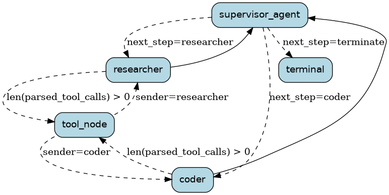

<!--
     Licensed to the Apache Software Foundation (ASF) under one
     or more contributor license agreements.  See the NOTICE file
     distributed with this work for additional information
     regarding copyright ownership.  The ASF licenses this file
     to you under the Apache License, Version 2.0 (the
     "License"); you may not use this file except in compliance
     with the License.  You may obtain a copy of the License at

       http://www.apache.org/licenses/LICENSE-2.0

     Unless required by applicable law or agreed to in writing,
     software distributed under the License is distributed on an
     "AS IS" BASIS, WITHOUT WARRANTIES OR CONDITIONS OF ANY
     KIND, either express or implied.  See the License for the
     specific language governing permissions and limitations
     under the License.
-->

# Agent Supervisor

This example fleshes out the `agent_supervisor.py` template found in
[`examples/templates`](../templates/agent_supervisor.py) into a full, runnable
example.

It resembles the [`multi-agent-collaboration`](../multi-agent-collaboration)
example -- a `researcher` agent (web search) and a `coder` agent (python
execution / charting) working together -- but instead of hardcoded transitions
between the two agents, an LLM-driven `supervisor_agent` decides which agent
should act next at each step, or when to stop. This mirrors LangGraph's own
["agent supervisor"](https://github.com/langchain-ai/langgraph/blob/main/examples/multi_agent/agent_supervisor.ipynb)
pattern.

Compare this example's state machine to `multi-agent-collaboration`'s to see
the difference between supervisor-routed and fixed-routed multi-agent designs.

## LLM calls

Unlike `multi-agent-collaboration` (which uses LangChain) or its `hamilton/`
variant, this example calls the plain [`openai`](https://pypi.org/project/openai/)
SDK directly -- the same approach used in
[`examples/email-assistant`](../email-assistant). This keeps the example
dependency-light and easy to follow without an extra framework layer.

## Running the example

Install the dependencies:

```bash
pip install -r requirements.txt
```

Set your API key(s):

```bash
export OPENAI_API_KEY=YOUR_KEY
# optional -- without this, web_search returns a placeholder string
export TAVILY_API_KEY=YOUR_KEY
```

Run the notebook:

```bash
jupyter notebook notebook.ipynb
```

Or run the application directly:

```bash
python application.py
```

Application run:

