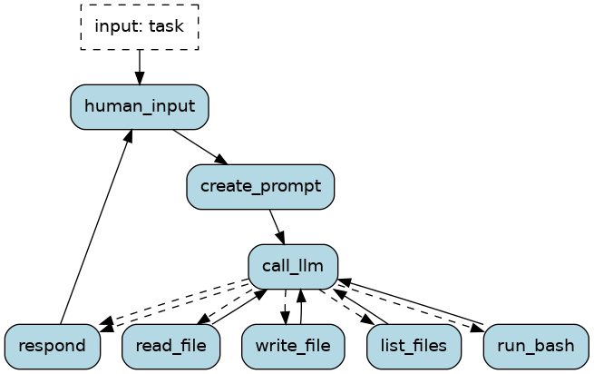

# Coding agent

A minimal coding agent harness: an LLM that reads files, writes files, and runs
shell commands in a loop until it has finished a task.

The point of this example is the *loop*. A tool-calling assistant runs one tool
and returns to the user. An agent keeps going on its own -- it reads a file,
sees what's in it, edits it, runs the tests, sees them fail, and tries again --
without a human in between. That is a cycle, and expressing cycles clearly is
what Burr is for.

## The loop

| Action | What it does |
| --- | --- |
| `human_input` | Takes the task and seeds the message history |
| `create_prompt` | A seam for shaping the prompt before each call -- add a file tree, a summary of earlier steps, retrieved context |
| `call_llm` | Asks the model what to do next: call a tool, or finish |
| `read_file` / `write_file` / `list_files` / `run_bash` | One bound action per tool, so each shows up separately in the Burr UI |
| `respond` | Surfaces the answer, or reports that the step budget ran out |

Two transitions leave `call_llm` for `respond`: one when the model answers
without requesting a tool, and one when `steps` reaches `max_steps`. Both exits
are listed before the tool transitions, because Burr takes the first condition
that matches. An agent that decides its own next step can loop forever, so the
budget is not optional.

Tool results are appended to `messages` as `role: "tool"` entries carrying the
`tool_call_id` they answer. That is what lets the model see what its last action
actually returned.

## Running it

    pip install -r requirements.txt
    python application.py

With no API key set, the example uses a scripted client that replays a fixed
sequence of tool calls, so it runs immediately and in CI. Set `OPENAI_API_KEY`
to use a real model instead.

Regenerating `statemachine.png` needs the Graphviz binary (`apt-get install
graphviz`), not just the Python package.

To watch a run in the Burr UI:

    burr

## Safety

`run_bash` executes shell commands with the permissions of the process running
the agent. File paths are confined to the workspace directory, but a shell
command can simply `cd` out of it. **This is a teaching example, not a sandbox.**
Run it against a directory you do not mind losing, ideally inside a container.

Adding a permission step before tool execution -- prompting for approval, or
checking an allowlist -- is the natural next thing to build.

## Known simplifications

- One tool call is executed per iteration; if the model requests several, the
  extras are dropped.
- `create_prompt` is a passthrough. It exists to show where prompt construction
  belongs, not because it does anything yet.
- Message history grows without bound. A longer-running agent needs summarisation
  or truncation.

## Files

- [application.py](application.py) -- the state machine, actions, and LLM clients
- [tools.py](tools.py) -- the four tools
- [notebook.ipynb](notebook.ipynb) -- the same example, walked through step by step
- [requirements.txt](requirements.txt) -- the environment