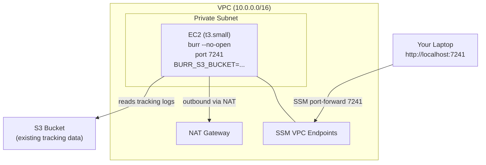

<!--
     Licensed to the Apache Software Foundation (ASF) under one
     or more contributor license agreements.  See the NOTICE file
     distributed with this work for additional information
     regarding copyright ownership.  The ASF licenses this file
     to you under the Apache License, Version 2.0 (the
     "License"); you may not use this file except in compliance
     with the License.  You may obtain a copy of the License at

       http://www.apache.org/licenses/LICENSE-2.0

     Unless required by applicable law or agreed to in writing,
     software distributed under the License is distributed on an
     "AS IS" BASIS, WITHOUT WARRANTIES OR CONDITIONS OF ANY
     KIND, either express or implied.  See the License for the
     specific language governing permissions and limitations
     under the License.
-->

# Deploy Burr UI on AWS (Private VPC, S3 Backend)

Deploy the Burr tracking UI server in a private VPC on AWS, reading tracking data from
an existing S3 bucket. Access is via AWS SSM Session Manager port forwarding — no public
IP, no open inbound ports.

## Overview

This deploys a single-tenant Burr UI server that:

- Runs in a private subnet inside a dedicated VPC
- Reads and indexes tracking logs from your existing S3 bucket
- Is accessible only via SSM port forwarding (no public internet exposure)
- Uses a single EC2 instance (not horizontally scaled — by design)



## Prerequisites

- AWS CLI v2 configured with credentials
- [AWS Session Manager plugin](https://docs.aws.amazon.com/systems-manager/latest/userguide/session-manager-working-with-install-plugin.html) installed
- Terraform >= 1.5
- An existing S3 bucket with Burr tracking data (written by `S3TrackingClient`)

## Configure

```bash
cd examples/deployment/aws/burr-ui/terraform
cp environments/dev.tfvars my.tfvars
```

Edit `my.tfvars` and set:
- `s3_bucket_name` — your existing Burr tracking bucket name (required)
- `aws_region` — the region where your bucket lives (default: us-east-1)

## Deploy

```bash
terraform init
terraform apply -var-file=my.tfvars
```

Wait 2-3 minutes for the instance to boot, install Burr, and start indexing.

## Access the Private UI

Use SSM port forwarding (no SSH key needed, no open ports):

```bash
# Get the instance ID from Terraform output
INSTANCE_ID=$(terraform output -raw instance_id)

# Start the port forward
aws ssm start-session --target $INSTANCE_ID \
  --document-name AWS-StartPortForwardingSession \
  --parameters '{"portNumber":["7241"],"localPortNumber":["7241"]}'
```

Then open http://localhost:7241 in your browser.

## Verify

- The UI loads and shows a list of projects from your S3 bucket
- Navigate into a project to see tracked application runs
- If the bucket is empty, the UI shows an empty project list (no errors)

## Teardown

```bash
terraform destroy -var-file=my.tfvars
```

## Security

- **No public IP.** The instance is in a private subnet with no inbound security group rules.
- **No SSH.** Access is exclusively via SSM Session Manager (port forwarding).
- **No open ports.** The security group allows egress only (for pip install and S3 access).
- **IMDSv2 enforced.** Instance metadata requires session tokens.
- **Encrypted EBS.** Root volume uses gp3 with encryption enabled.
- **Least-privilege IAM.** The instance role has read-only access to the single specified bucket.
- **VPC endpoints for SSM.** SSM control plane traffic stays within the VPC.

## Architecture Decisions

| Decision | Rationale |
|----------|-----------|
| Single EC2 instance | Issue #391 requests single-tenant. The UI is read-heavy and not write-bound. |
| SSM over bastion/ALB | Simplest private access. No key management, no extra instances, no public endpoints. |
| NAT Gateway | Required for pip install on boot. Could be replaced with VPC endpoint for S3 + pre-baked AMI. |
| No bucket creation | Issue says "parameterizable on the S3 bucket" — assumes an existing one. |

## Troubleshooting

| Problem | Solution |
|---------|----------|
| SSM can't connect | Ensure the SSM plugin is installed and the instance has `AmazonSSMManagedInstanceCore` policy |
| UI loads but no projects | Check that `s3_bucket_name` matches your tracking bucket and the region is correct |
| Server not starting | SSM into the instance: `sudo journalctl -u burr-ui` |
| Indexing errors | Check `/var/log/burr-ui-setup.log` on the instance |

## Production Notes

- For team access, place an internal ALB in front and connect via VPN
- For HTTPS, add an ACM certificate and ALB listener
- For persistent index across restarts, enable S3 snapshot (set `BURR_LOAD_SNAPSHOT_ON_START=true`)
- See [S3 Tracking on AWS](https://burr.apache.org/concepts/aws-tracking/) for all configuration options
